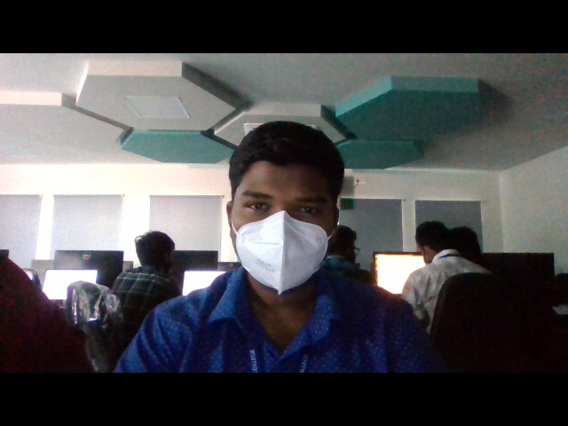

# Image-Acquisition-from-Web-Camera
## Aim
 
Aim:
 
To write a python program using OpenCV to capture the image from the web camera and do the following image manipulations.
i) Write the frame as JPG 
ii) Display the video 
iii) Display the video by resizing the window
iv) Rotate and display the video

## Software Used
Anaconda - Python 3.7
## Algorithm
### Step 1:
Import the packages(numpy and cv2).
<br>

### Step 2:
Use VideoCapture method to access through webcam, read the captured image and write the frame as jpg file.
<br>

### Step 3:
Use the same VideoCapture method to display video through webcam
<br>

### Step 4:
Now display the by resizing window image.
<br>

### Step 5:
Now display the image by rotating it
<br>

## Program:
``` Python
### Developed By: K.Balaji
### Register No: 212221230011

## i) Write the frame as JPG file

import cv2
videoCaptureObject=cv2.VideoCapture(0)
while True:
    ret,frame=videoCaptureObject.read()
    cv2.imshow('vedio rolling',frame)
    cv2.imwrite("myphoto.jpg",frame)
    if cv2.waitKey(1)==ord('q'):
        break
videoCaptureObject.release()
cv2.destroyAllWindows()


## ii) Display the video
import cv2
Capture=cv2.VideoCapture(0)
while(True):
    R,Frame=Capture.read()
    cv2.imshow("Frame",Frame)
    cv2.imwrite('Photo.jpg',Frame)
    if cv2.waitKey(1)==ord('q'):
        break
Capture.release()
cv2.destroyAllWindows()


## iii) Display the video by resizing the window
import cv2
import numpy as np

cap = cv2.VideoCapture(0)

while True:
    ret, frame = cap.read()
    width = int(cap.get(3))
    height = int(cap.get(4))
    
    image = np.zeros(frame.shape, np.uint8)
    smaller_frame = cv2.resize(frame, (0,0), fx = 0.5, fy = 0.5)
    image[:height//2, :width//2] = smaller_frame
    image[height//2:, :width//2] = smaller_frame
    image[:height//2, width//2:] = smaller_frame
    image[height//2:, width//2:] = smaller_frame
    
    cv2.imshow('frame',image)
    if cv2.waitKey(1) == ord('m'):
        break
cap.release()
cv2.destroyAllWindows()


## iv) Rotate and display the video
import numpy as np
import cv2

Capture=cv2.VideoCapture(0)
while(True):
    R,Frame=Capture.read()
    Width=int(Capture.get(3))
    Height=int(Capture.get(4))
    image=np.zeros(Frame.shape,np.uint8)
    smaller_frame=cv2.resize(Frame, (0,0), fx=0.5, fy=0.5)
    image[:Height//2,:Width//2]=cv2.rotate(smaller_frame,cv2.ROTATE_180)
    image[Height//2:,:Width//2]=smaller_frame
    image[:Height//2,Width//2:]=cv2.rotate(smaller_frame,cv2.ROTATE_180)
    image[Height//2:,Width//2:]=smaller_frame
    cv2.imshow("Frame",image)
    cv2.imwrite('bala.jpg',image)
    if cv2.waitKey(1)==ord('m'):
        break
Capture.release()
cv2.destroyAllWindows()


```
## Output

### i) Write the frame as JPG image

</br>
</br>


### ii) Display the video

</br>
</br>


### iii) Display the video by resizing the window

</br>
</br>


### iv) Rotate and display the video

</br>
</br>


## Result:
Thus the image is accessed from webcamera and displayed using openCV.
